# cluade_agents 仓库架构说明

## 1. 上下文

| 项目 | 说明 |
| --- | --- |
| 范围 | `src/` 下的 TypeScript/Bun CLI Agent 系统 |
| 读者 | AI 编程代理 / 工程师 |
| 来源 | 当前仓库源码、`README.md`、`skill_design.md` |
| 目标 | 用架构图、模块单元图、单元设计详情图和实体图说明现有系统边界 |
| 非目标 | 不做问题分析、重构方案或实施计划 |
| 假设 | 部分大型运行链路由分散文件共同完成，本文按源码中可见边界归纳 |

## 2. 总体架构图

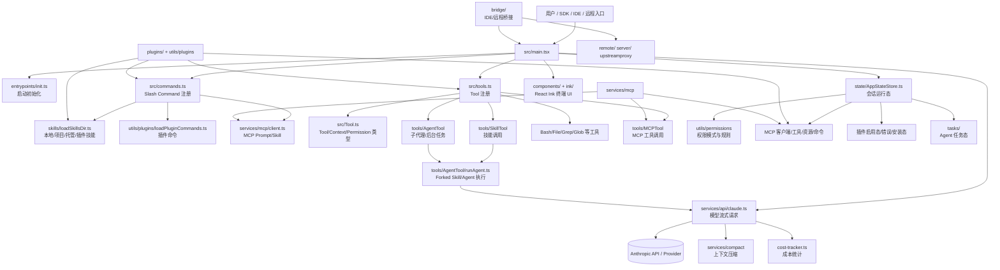

## 3. 模块单元图

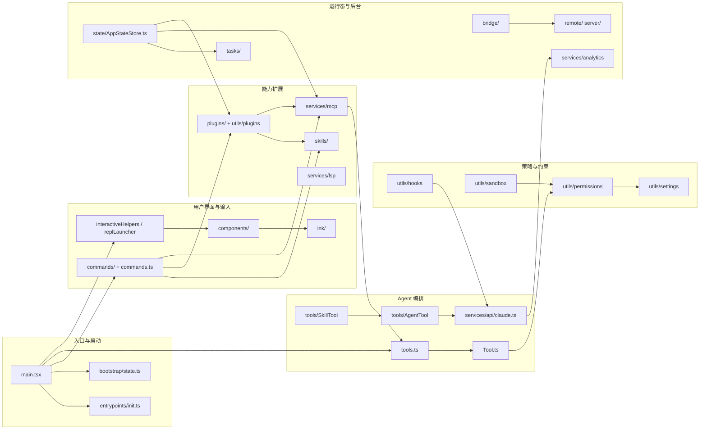

## 4. 模块职责

| ID | 模块 | 主要文件 / 目录 | 职责 | 依赖 | 不负责 |
| --- | --- | --- | --- | --- | --- |
| M1 | 启动入口 | `src/main.tsx` | 解析 CLI、预取设置/钥匙串、初始化插件/技能/MCP/权限、创建 UI 或非交互会话 | `commands.ts`, `tools.ts`, `entrypoints/init.ts`, `state/` | 单个工具的业务执行 |
| M2 | 命令系统 | `src/commands.ts`, `src/commands/` | 注册 Slash Command，合并内置、技能、插件、MCP 命令 | `skills/loadSkillsDir.ts`, `utils/plugins/loadPluginCommands.ts` | 模型工具调用执行 |
| M3 | 工具系统 | `src/tools.ts`, `src/tools/`, `src/Tool.ts` | 暴露模型可调用工具，定义工具 schema、上下文、进度、权限上下文 | `utils/permissions`, `services/mcp`, `tools/*` | Slash Command 文本解析 |
| M4 | 模型请求层 | `src/services/api/claude.ts`, `src/query/` | 将消息、系统提示、工具 schema 转为 API 请求，处理流式事件、成本、上下文管理 | Anthropic SDK、`utils/messages`, `utils/api` | UI 呈现 |
| M5 | Agent 编排 | `src/tools/AgentTool/`, `src/tasks/`, `src/utils/swarm/` | 生成子代理、后台任务、工作树隔离、远程任务、团队协作 | `runAgent.ts`, `tasks/*`, `utils/worktree` | 插件安装 |
| M6 | Skill 系统 | `src/tools/SkillTool/`, `src/skills/`, `src/skills/loadSkillsDir.ts` | 加载技能 frontmatter，向模型暴露索引，命中后 inline 或 fork 执行技能正文 | `commands.ts`, `AgentTool`, `utils/frontmatterParser` | 普通命令 UI |
| M7 | MCP 系统 | `src/services/mcp/`, `src/tools/MCPTool/` | 连接 MCP server，生成工具/资源/Prompt/Skill，处理认证、截断、资源读取 | MCP SDK、OAuth、AppState | 本地插件缓存管理 |
| M8 | 插件系统 | `src/plugins/`, `src/utils/plugins/` | 加载内置和第三方插件，解析 manifest，注入 commands/skills/agents/hooks/MCP/LSP | `types/plugin.ts`, settings, marketplace/cache | 模型推理 |
| M9 | 权限系统 | `src/utils/permissions/`, `src/types/permissions.ts` | 管理权限模式、allow/deny/ask 规则、危险命令识别、工作目录范围 | settings、ToolUseContext、UI permission dialogs | 工具具体执行结果 |
| M10 | 终端 UI | `src/components/`, `src/ink/` | React Ink 组件、消息渲染、设置/权限/MCP/输入面板 | AppState、commands、tools | 后端 API 协议 |
| M11 | Bridge/Remote | `src/bridge/`, `src/remote/`, `src/server/` | IDE/远程控制桥接、session spawn、轮询/心跳、远程会话 | API client、worktree、session runner | 本地 Tool schema 定义 |
| M12 | 状态存储 | `src/state/AppStateStore.ts` | 汇聚会话设置、权限、MCP、插件、任务、todo、UI 选择态 | 各子系统类型 | 持久化存储细节 |

## 5. 单元设计详情图

### 5.1 Tool 调用单元

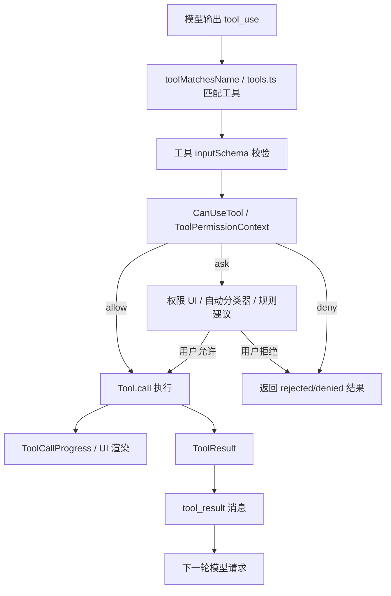

| 项目 | 说明 |
| --- | --- |
| 入口 | 模型响应中的 `tool_use` |
| 核心类型 | `Tool`, `Tools`, `ToolUseContext`, `ToolPermissionContext` |
| 注册来源 | `src/tools.ts` 的 `getAllBaseTools()` 与运行时 MCP/plugin 注入 |
| 权限边界 | `utils/permissions` 产出的 allow/ask/deny 决策 |
| 输出 | `tool_result`、进度事件、UI JSX 或系统消息 |

### 5.2 Skill 调用单元

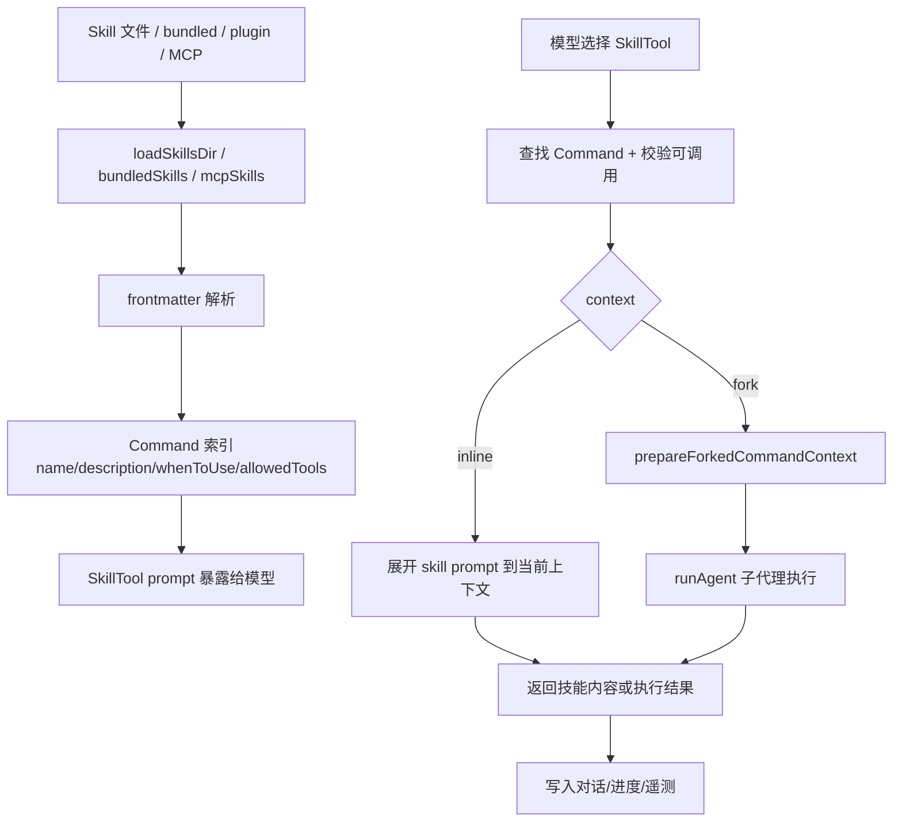

| 项目 | 说明 |
| --- | --- |
| 入口 | 用户 Slash Command 或模型调用 `SkillTool` |
| 技能索引 | 只把名称、描述、适用时机等摘要暴露给模型 |
| 正文加载 | 命中技能后才展开正文，支持参数替换、hooks、allowed tools |
| 执行模式 | 默认 inline；frontmatter `context: fork` 时用子代理隔离执行 |
| 状态记录 | `bootstrap/state.ts` 记录 invoked skill，遥测记录调用来源 |

### 5.3 Agent 编排单元

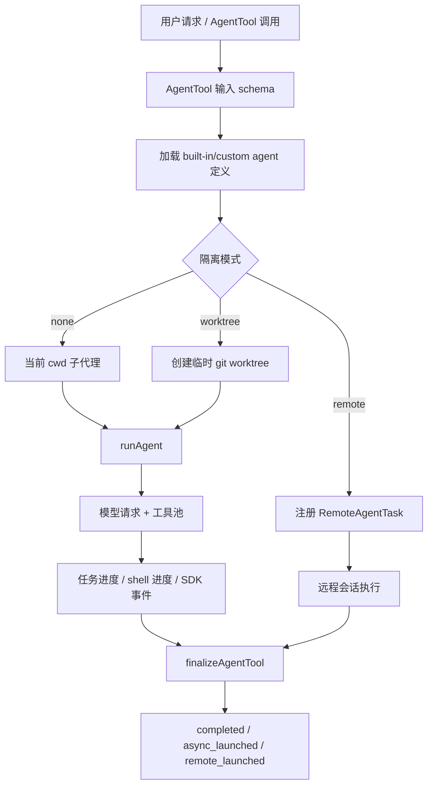

| 项目 | 说明 |
| --- | --- |
| 入口 | `tools/AgentTool/AgentTool.tsx` |
| 代理定义 | `tools/AgentTool/loadAgentsDir.ts`、内置 agent、插件 agent |
| 工具池 | `assembleToolPool()` 按权限、agent 类型和环境过滤 |
| 隔离 | 普通 cwd、临时 worktree、远程 CCR 环境 |
| 输出 | 同步完成、后台任务 ID、远程任务 URL、进度事件 |

### 5.4 MCP 连接单元

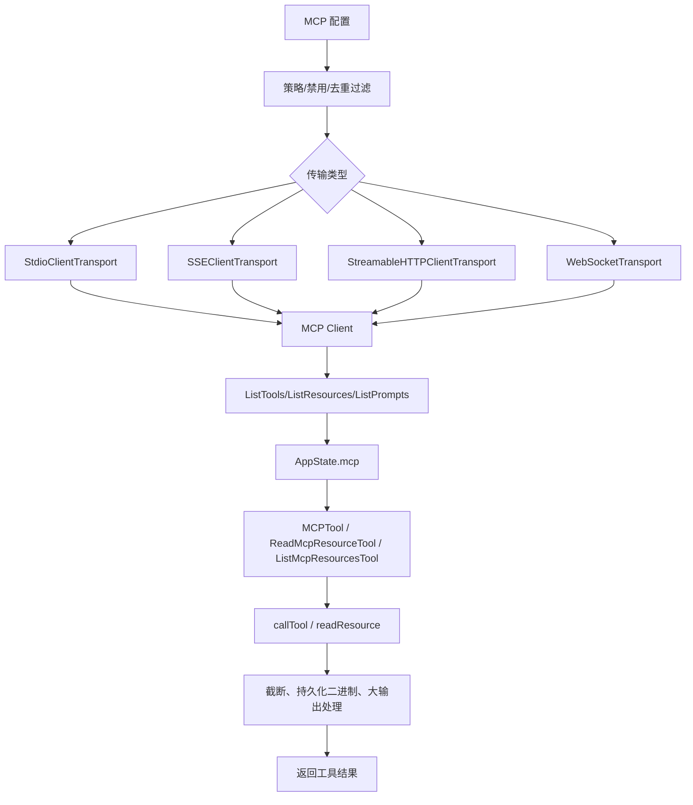

| 项目 | 说明 |
| --- | --- |
| 入口 | `services/mcp/client.ts` |
| 协议 | stdio、SSE、streamable HTTP、WebSocket、SDK control transport |
| 可产出能力 | MCP 工具、资源、Prompts、MCP Skills |
| 错误处理 | OAuth 401、session expired、tool isError、大输出截断 |
| 状态位置 | `AppState.mcp.clients/tools/commands/resources` |

### 5.5 插件加载单元

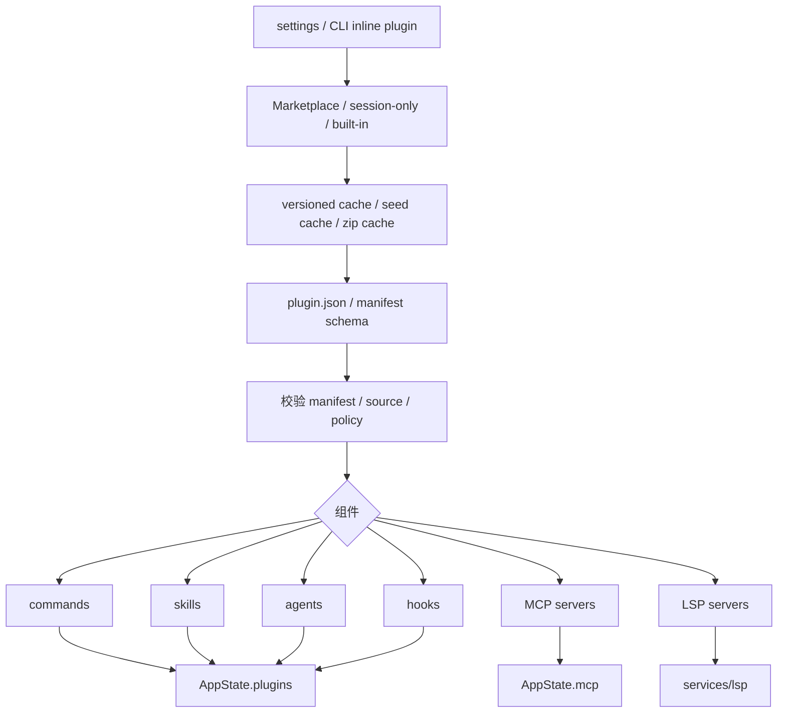

| 项目 | 说明 |
| --- | --- |
| 入口 | `utils/plugins/pluginLoader.ts`、`plugins/builtin/` |
| 发现顺序 | marketplace 插件、session-only 插件、内置插件 |
| 组件类型 | commands、agents、skills、hooks、output-styles、MCP、LSP |
| 失败记录 | `PluginError` 联合类型进入 `AppState.plugins.errors` |
| 刷新 | 插件磁盘状态变化后由 `needsRefresh` 驱动交互或 headless 刷新 |

## 6. 核心实体图

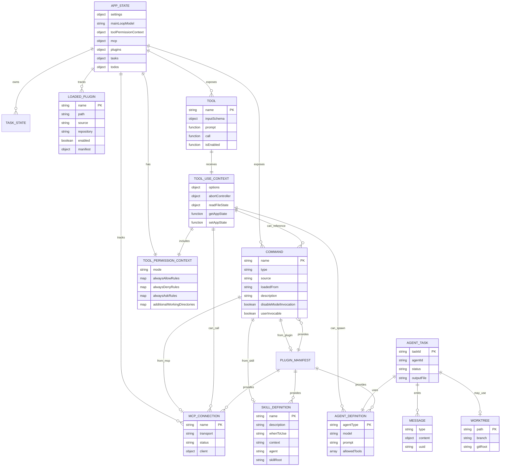

## 7. 实体字段表

### 7.1 Command

| 字段 | 类型 | 含义 | 约束 |
| --- | --- | --- | --- |
| `name` | string | 命令唯一名 | 注册列表内应唯一 |
| `type` | `prompt/local/local-jsx` | 命令执行形态 | 决定是否注入模型或本地执行 |
| `source` | enum | 来源：builtin、plugin、mcp、bundled 等 | 影响可见性和遥测 |
| `description` | string | 命令说明 | 用于帮助、自动补全和模型技能索引 |
| `allowedTools` | string[] | prompt command 可用工具 | 可为空 |
| `whenToUse` | string | Skill 适用时机 | 仅技能类命令常见 |
| `disableModelInvocation` | boolean | 是否禁止模型调用 | true 时不应通过 SkillTool 触发 |
| `userInvocable` | boolean | 用户是否可直接调用 | 默认 true |

### 7.2 Tool

| 字段 | 类型 | 含义 | 约束 |
| --- | --- | --- | --- |
| `name` | string | 工具名 | 模型 tool_use 匹配键 |
| `inputSchema` | Zod/JSON Schema | 工具输入约束 | 必须可转为 API tool schema |
| `prompt` | function | 工具说明生成 | 可能依赖当前工具池、权限、agent 定义 |
| `call` | function | 工具执行逻辑 | 必须返回 `ToolResult` 或进度 |
| `isEnabled` | function | 当前环境是否启用 | 受 feature/env/user type 影响 |

### 7.3 ToolUseContext

| 字段 | 类型 | 含义 | 约束 |
| --- | --- | --- | --- |
| `options.commands` | Command[] | 当前可用命令 | 传给工具与技能 |
| `options.tools` | Tool[] | 当前可用工具 | 可能包含 MCP 动态工具 |
| `options.mcpClients` | MCPServerConnection[] | MCP 连接 | 工具执行时可访问 |
| `options.agentDefinitions` | AgentDefinitionsResult | 可用 agent 定义 | AgentTool 过滤后使用 |
| `abortController` | AbortController | 取消信号 | 工具必须尊重终止 |
| `getAppState` | function | 读取运行态 | 不直接持有可变状态副本 |
| `setAppState` | function | 更新运行态 | 子代理可能被特殊包装 |

### 7.4 ToolPermissionContext

| 字段 | 类型 | 含义 | 约束 |
| --- | --- | --- | --- |
| `mode` | PermissionMode | 当前权限模式 | default、plan、bypassPermissions、auto 等 |
| `additionalWorkingDirectories` | Map | 额外可访问工作目录 | 必须来自有效来源 |
| `alwaysAllowRules` | map | 自动允许规则 | auto 模式会剥离危险规则 |
| `alwaysDenyRules` | map | 自动拒绝规则 | 优先阻断对应工具/内容 |
| `alwaysAskRules` | map | 总是询问规则 | 触发 UI 或 headless 策略 |
| `prePlanMode` | PermissionMode | 进入 plan 前的模式 | 用于退出 plan 后恢复 |

### 7.5 LoadedPlugin

| 字段 | 类型 | 含义 | 约束 |
| --- | --- | --- | --- |
| `name` | string | 插件名 | 插件标识的一部分 |
| `manifest` | PluginManifest | 插件元数据 | 需通过 schema 校验 |
| `path` | string | 插件目录 | 必须位于允许的缓存或 session 目录 |
| `repository` | string | marketplace/repo 标识 | 用于版本、遥测、去重 |
| `commandsPath/skillsPath/agentsPath` | string | 组件目录 | 可选 |
| `hooksConfig` | HooksSettings | 插件 hooks | 可选，需校验 |
| `mcpServers` | object | 插件提供的 MCP server | 需按 MCP 配置规则合并 |

### 7.6 AppState

| 字段 | 类型 | 含义 | 约束 |
| --- | --- | --- | --- |
| `settings` | SettingsJson | 当前设置快照 | 初始化和设置变更后刷新 |
| `mainLoopModel` | ModelSetting | 主循环模型 | 与 provider、能力、CLI 参数协同 |
| `toolPermissionContext` | ToolPermissionContext | 当前权限上下文 | 工具执行前读取 |
| `mcp` | object | MCP clients/tools/commands/resources | 动态连接和插件刷新会改变 |
| `plugins` | object | 插件启用态、命令、错误、安装态 | `needsRefresh` 标记陈旧状态 |
| `tasks` | map | 后台/agent 任务 | key 为 taskId |
| `todos` | map | agent 维度 todo list | key 为 agentId |

## 8. 核心流程

### 8.1 CLI 启动与会话装配

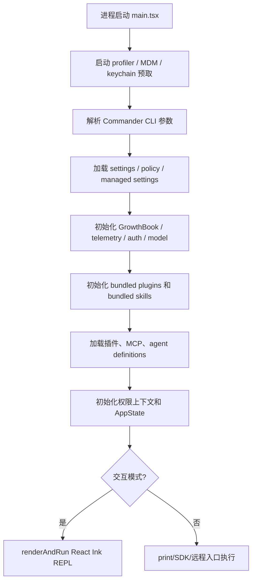

| 步骤 | 执行者 | 动作 | 输出 |
| --- | --- | --- | --- |
| 1 | `main.tsx` | 触发早期预取和重模块加载前 profiler | 启动性能上下文 |
| 2 | CLI parser | 解析命令、权限、模型、MCP、远程等参数 | 会话配置 |
| 3 | settings/policy | 合并用户、项目、托管和策略设置 | 有效配置 |
| 4 | plugins/skills/MCP | 注册扩展能力 | 命令、工具、资源、agent 定义 |
| 5 | state | 构建 AppState 和 ToolUseContext | 可执行会话 |
| 6 | UI/print | 进入 REPL 或非交互请求 | 用户可交互界面或一次性输出 |

### 8.2 一轮模型请求与工具循环

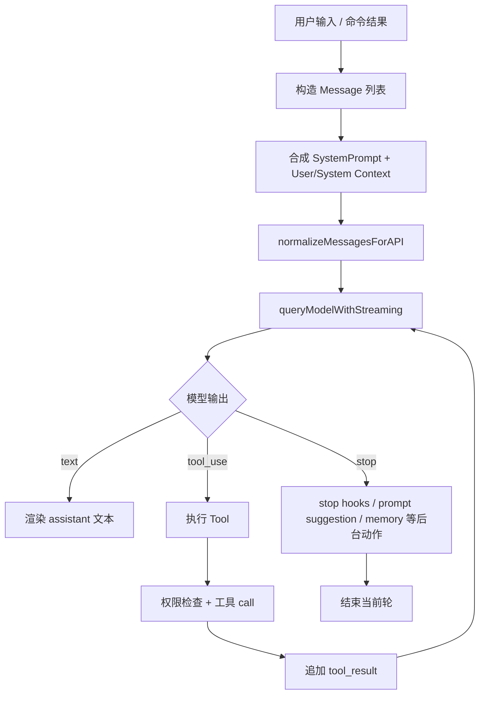

| 步骤 | 执行者 | 动作 | 输出 |
| --- | --- | --- | --- |
| 1 | REPL/SDK | 收集用户输入、附件、命令输出 | Message[] |
| 2 | Query 层 | 注入系统提示、工具 schema、MCP instructions | API 请求参数 |
| 3 | API 层 | 流式请求模型 | text/tool_use/error |
| 4 | Tool 层 | 对 tool_use 进行校验、授权、执行 | tool_result |
| 5 | Query 层 | 有 tool_result 时继续下一次模型请求 | 多步工具循环 |
| 6 | stopHooks | 回合结束后触发 hooks 和后台任务 | 完成态或附加消息 |

### 8.3 Skill 从发现到执行

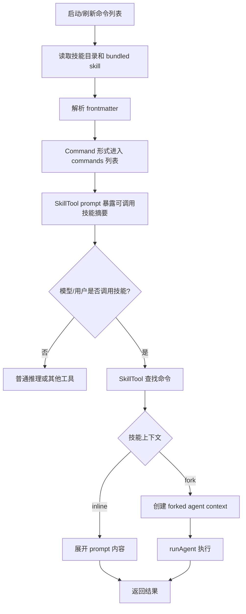

### 8.4 插件能力进入系统

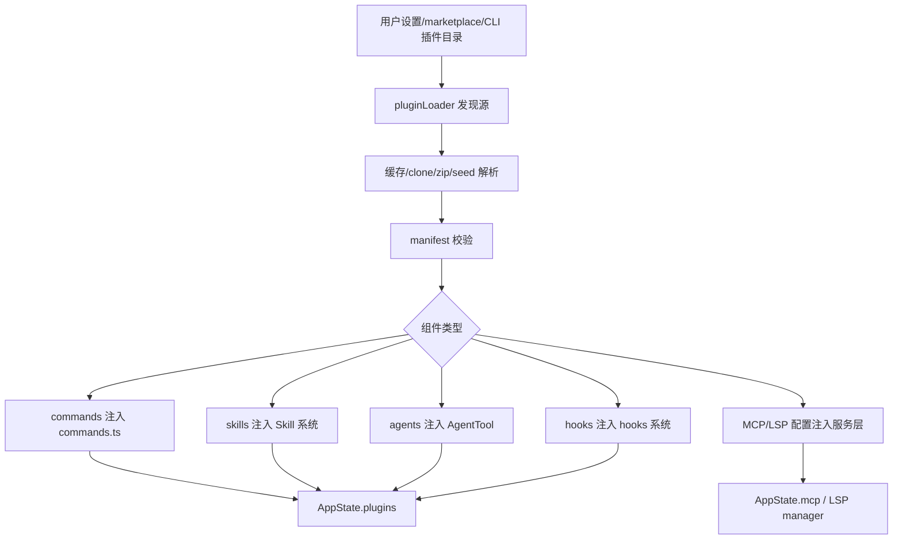

### 8.5 Bridge 远程会话循环

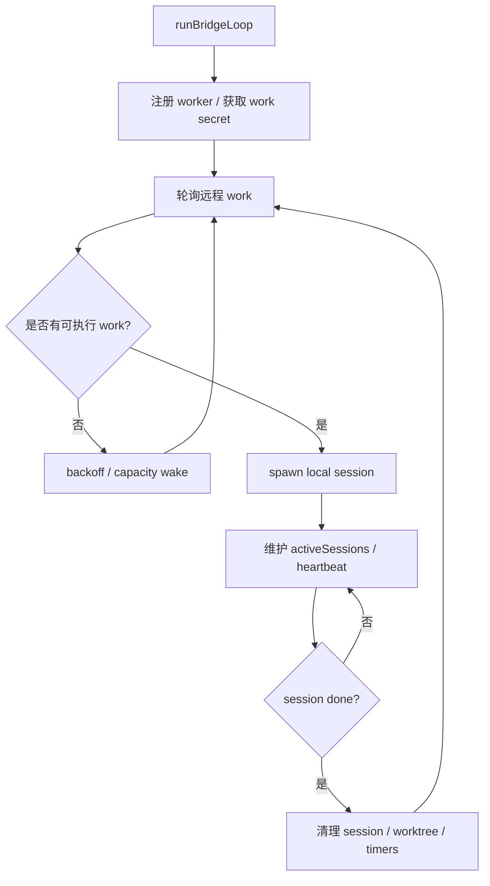

## 9. 外部依赖

| ID | 依赖 | 使用方式 | 用途 |
| --- | --- | --- | --- |
| D1 | Bun | runtime、`bun:bundle` feature gates | 运行、构建、死代码消除 |
| D2 | React + Ink | `components/`, `ink/` | 终端 UI |
| D3 | Commander.js | `main.tsx` | CLI 参数解析 |
| D4 | Zod | 工具/配置/插件 schema | 输入校验 |
| D5 | Anthropic SDK | `services/api/claude.ts` | 模型流式请求 |
| D6 | MCP SDK | `services/mcp/client.ts` | MCP client、transport、schema |
| D7 | GrowthBook / analytics | `services/analytics` | feature gate、动态配置、遥测 |
| D8 | OAuth / Keychain | `utils/auth`, `utils/secureStorage` | 登录、token、凭据 |
| D9 | git / worktree | `utils/git`, `utils/worktree` | repo 检测、agent 隔离 |
| D10 | ripgrep | `GrepTool`, `utils/ripgrep` | 快速文件搜索 |

## 10. 关键契约

### 10.1 Tool 契约

| 项目 | 说明 |
| --- | --- |
| 输入 | 模型产生的工具名和 JSON 参数 |
| 默认行为 | 按 `tools.ts` 中可启用工具集合匹配工具 |
| 支持条件 | feature gate、env、用户类型、agent 类型、权限规则 |
| 输出 | `ToolResult`、进度事件、UI 渲染片段 |
| 错误 | schema 校验失败、权限拒绝、执行异常、超时/abort |
| 副作用 | 文件、shell、MCP、状态更新等由具体工具决定 |

### 10.2 Command 契约

| 项目 | 说明 |
| --- | --- |
| 输入 | Slash command 名称与参数 |
| 默认行为 | 在内置、项目、用户、插件、MCP 命令中解析 |
| 支持条件 | `isEnabled`、availability、user type、feature gate |
| 输出 | 本地结果、JSX UI、或 prompt 内容 |
| 错误 | 命令不存在、禁用、参数不合法、运行异常 |
| 副作用 | 可能更新 AppState、settings、会话消息或触发模型请求 |

### 10.3 Skill 契约

| 项目 | 说明 |
| --- | --- |
| 输入 | skill 名称和参数 |
| 默认行为 | 只暴露索引，命中后再加载正文 |
| 支持条件 | `disable-model-invocation`、`user-invocable`、路径匹配、allowed tools |
| 输出 | inline prompt 内容或 forked agent 执行结果 |
| 错误 | 技能不存在、禁止调用、frontmatter 非法、fork 执行失败 |
| 副作用 | 记录调用、触发 hooks、可能启动子代理 |

### 10.4 Permission 契约

| 项目 | 说明 |
| --- | --- |
| 输入 | 工具名、工具参数、当前权限上下文 |
| 默认行为 | 按模式和规则得到 allow/ask/deny |
| 支持条件 | 工作目录、危险命令规则、auto classifier、plan mode |
| 输出 | PermissionResult 和可选 updatedInput |
| 错误 | 路径越界、危险规则、用户拒绝、策略禁止 |
| 副作用 | 用户允许时可追加规则或更新设置 |

## 11. 设计决策

| ID | 决策 | 采用方案 | 放弃方案 | 原因 | 影响 |
| --- | --- | --- | --- | --- | --- |
| R1 | 命令和工具分离 | Slash Command 走 `commands.ts`，模型工具走 `tools.ts` | 用单一注册表承载所有能力 | 用户入口与模型工具调用生命周期不同 | 边界清晰，但扩展能力需同时考虑两条路径 |
| R2 | Skill 按需展开 | 先暴露 frontmatter 摘要，命中后加载正文 | 启动时把所有技能正文放入上下文 | 控制 token、降低噪声、便于审计 | SkillTool 成为技能正文进入上下文的关键入口 |
| R3 | ToolUseContext 聚合运行依赖 | 工具通过 context 访问 commands/tools/MCP/AppState | 工具直接 import 全局 mutable state | 便于子代理、SDK、测试和 forked context | context 字段较宽，需要维持类型稳定 |
| R4 | 插件组件化 | 插件可提供 commands/skills/agents/hooks/MCP/LSP | 插件只提供命令 | 扩展面覆盖 Agent 实际能力边界 | loader 和错误模型复杂度较高 |
| R5 | AppState 汇聚会话状态 | UI、MCP、插件、任务、权限进入统一状态 | 各模块各自维护 UI 状态 | React Ink UI 和后台任务需要一致视图 | AppState 变大，需要避免无边界写入 |
| R6 | Feature gate 结合动态配置 | `bun:bundle` 做死代码消除，GrowthBook/env 做运行期开关 | 全部运行时判断 | 减小构建体积并支持灰度 | 代码中存在条件 require 和 gated schema |
| R7 | Agent 支持隔离 | 支持 cwd、worktree、remote 执行 | 所有子代理共享主工作目录 | 降低并行修改冲突，支持远程任务 | 需要任务、权限、清理和进度桥接 |

## 12. 不变量

| ID | 规则 |
| --- | --- |
| C1 | 模型可调用工具必须来自当前会话启用的工具集合。 |
| C2 | 工具执行前必须经过对应 schema 和权限路径。 |
| C3 | Skill 正文不得默认常驻上下文，必须通过命令调用或 SkillTool 命中后展开。 |
| C4 | `disable-model-invocation` 为 true 的技能不得被模型通过 SkillTool 调用。 |
| C5 | MCP 动态工具、命令和资源必须写入当前 `AppState.mcp` 后才可被 UI 和工具链消费。 |
| C6 | 插件 manifest、组件路径和策略来源必须先校验，再进入 commands/skills/agents/MCP。 |
| C7 | 子代理隔离执行产生的 worktree、timer、task 状态必须在完成或取消后清理。 |
| C8 | 权限规则中的危险 shell / PowerShell 自动允许模式必须被识别并限制。 |
| C9 | UI-only system message 在进入 API 消息归一化边界时不得作为普通用户可见数据泄漏。 |
| C10 | AppState 更新必须保留已有任务、MCP、插件和权限语义，不能由单个工具随意覆盖全局状态。 |

## 13. 扩展点

| ID | 扩展点 | 后续方向 |
| --- | --- | --- |
| X1 | 新工具 | 在 `src/tools/` 增加 Tool，并通过 `tools.ts` 注册与 gated enablement 控制。 |
| X2 | 新 Slash Command | 在 `src/commands/` 增加命令，或通过本地/项目/插件命令目录加载。 |
| X3 | 新 Skill | 增加 bundled skill 或文件型 skill，通过 frontmatter 描述适用时机与工具边界。 |
| X4 | 新插件组件 | 扩展 plugin manifest schema 和 loader，将能力映射到 AppState 对应区域。 |
| X5 | 新 MCP transport 或能力 | 在 `services/mcp/client.ts` 附近扩展连接、发现和 tool/resource 归一化逻辑。 |
| X6 | 新 Agent 类型 | 增加 built-in/custom agent 定义，并更新工具池过滤和权限约束。 |
| X7 | 新权限模式 | 扩展 `types/permissions.ts` 与 `utils/permissions` 决策链。 |
| X8 | 新 UI 面板 | 在 `components/` 和 `ink/` 中接入 AppState selector，避免直接耦合执行层。 |

