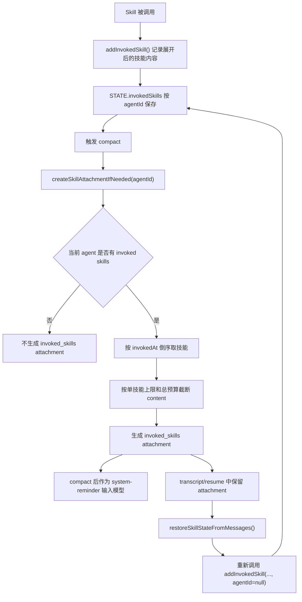
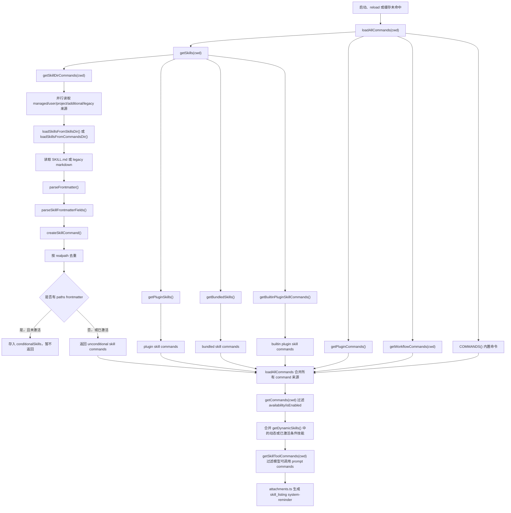
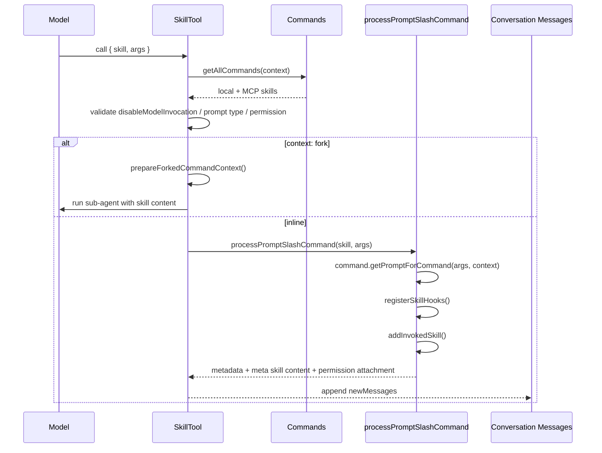
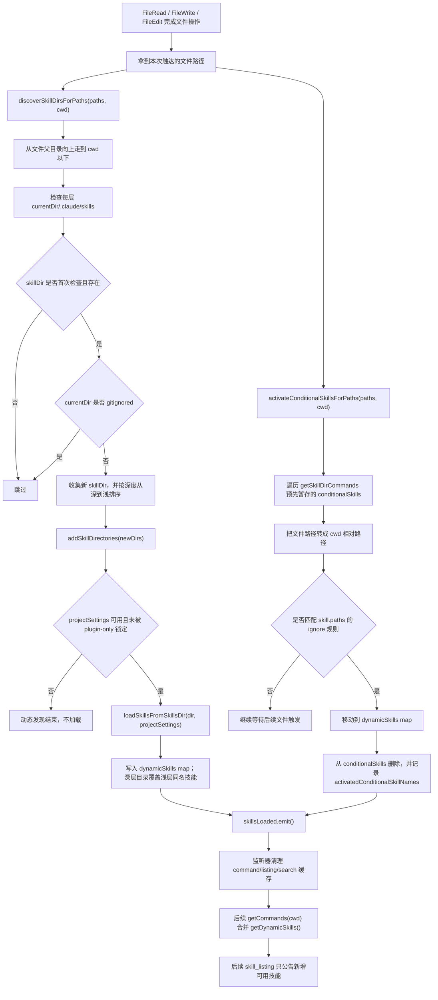
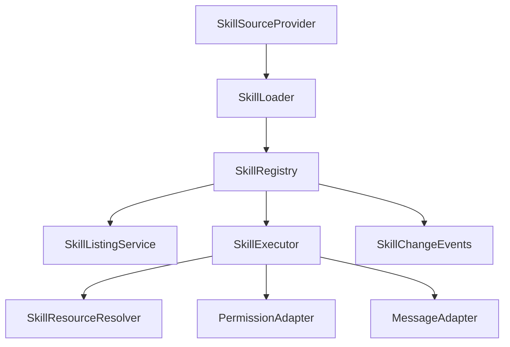

# Skill Runtime Loading and SDK Design

## 1. 上下文

### 1.1 范围

本文档基于 `src/` 下当前实现，说明 Skill 在运行时如何被发现、解析、暴露给模型、按需加载完整内容，以及模型如何通过 Skill 内容中的路径提示找到依赖资源文件。

本文档同时给出将 Skill 运行时抽象为 SDK 的目标设计，便于后续把当前 CLI/REPL 内聚实现拆成可被 CLI、SDK、远程桥接、插件系统、MCP 技能复用的库接口。

### 1.2 非目标

| 非目标 | 说明 |
| --- | --- |
| 不重写现有权限系统 | SDK 只暴露权限决策接口，不在本设计中改变现有 allow/deny/ask 语义。 |
| 不改变 Skill 文件格式 | 仍以 `skill-name/SKILL.md` 作为主格式，保留 legacy `/commands` 兼容。 |
| 不改变模型协议 | 仍通过 Skill tool、system-reminder、meta user message 等现有消息形态输入模型。 |

## 2. 当前运行时架构

### 2.1 主要组件

| 组件 | 文件 | 职责 |
| --- | --- | --- |
| Skill 目录加载器 | `src/skills/loadSkillsDir.ts` | 从 managed/user/project/additional/legacy 目录读取 `SKILL.md`，解析 frontmatter，创建 `Command`。 |
| Command 聚合器 | `src/commands.ts` | 聚合 bundled、built-in plugin、文件技能、workflow、plugin、内置命令和动态技能。 |
| SkillTool | `src/tools/SkillTool/SkillTool.ts` | 暴露给模型的技能执行工具，校验技能名、权限、执行 inline/fork skill。 |
| SkillTool Prompt | `src/tools/SkillTool/prompt.ts` | 告诉模型如何使用 Skill tool，并控制可用技能列表的预算格式。 |
| Slash Command 处理器 | `src/utils/processUserInput/processSlashCommand.tsx` | 把技能命令展开成 meta user message，并登记 hooks、invoked skill、附加权限。 |
| 附件系统 | `src/utils/attachments.ts` | 在对话中注入 `skill_listing`、`dynamic_skill`、`invoked_skills` 等 system-reminder。 |
| SDK init 消息 | `src/utils/messages/systemInit.ts` | 给 SDK/remote client 输出当前 tools、slash commands、skills、agents、plugins 摘要。 |
| 动态发现触发器 | `src/tools/FileReadTool/*`, `src/tools/FileWriteTool/*`, `src/tools/FileEditTool/*` | 文件读写编辑后发现嵌套 `.claude/skills`，激活 path 条件技能。 |
| MCP Skill 构造桥 | `src/skills/mcpSkillBuilders.ts` | 以注册表方式把 `createSkillCommand` 和 `parseSkillFrontmatterFields` 暴露给 MCP 技能加载，避免导入环。 |

### 2.2 静态加载来源

`getSkillDirCommands(cwd)` 是文件型 skill 的主加载入口。它加载以下来源：

| 来源 | 路径规则 | source | loadedFrom |
| --- | --- | --- | --- |
| 管理策略技能 | `getManagedFilePath()/.claude/skills` | `policySettings` | `skills` |
| 用户技能 | `getClaudeConfigHomeDir()/skills` | `userSettings` | `skills` |
| 项目技能 | 从 cwd 向上查找 `.claude/skills` | `projectSettings` | `skills` |
| additional dir | `--add-dir/.claude/skills` | `projectSettings` | `skills` |
| legacy commands | `.claude/commands` | 对应 settings source | `commands_DEPRECATED` |

`/skills/` 目录只支持目录格式：

```text
.claude/skills/
  my-skill/
    SKILL.md
    scripts/
    assets/
    references/
```

单个 `.md` 文件不会从 `/skills/` 目录加载；legacy `/commands/` 仍兼容单文件和 `SKILL.md` 目录格式。

### 2.3 Skill 解析实体

`parseSkillFrontmatterFields()` 从 frontmatter 和 markdown body 中提取模型可见和运行时字段。

| 字段 | 来源 | 运行语义 |
| --- | --- | --- |
| `name` / `displayName` | frontmatter 或目录名 | 目录名是实际技能名；frontmatter `name` 用作显示名。 |
| `description` | frontmatter 或 markdown 首段 | 用于 skill listing、发现、SDK init 摘要。 |
| `when_to_use` | frontmatter | 合并进模型可见描述，帮助模型判断何时调用。 |
| `allowed-tools` | frontmatter | 技能展开后追加到工具权限上下文。 |
| `argument-hint` / `arguments` | frontmatter | 参数提示和命名参数替换。 |
| `model` | frontmatter | inline/fork 执行时覆盖模型。 |
| `effort` | frontmatter | 执行后覆盖 effort。 |
| `disable-model-invocation` | frontmatter | 阻止模型通过 SkillTool 调用。 |
| `user-invocable` | frontmatter | 控制是否出现在用户 slash command 或模型-only 技能形态。 |
| `hooks` | frontmatter | 技能调用时注册为 session hooks。 |
| `context: fork` | frontmatter | 技能在子 agent 中隔离执行。 |
| `agent` | frontmatter | fork 技能指定子 agent 类型。 |
| `paths` | frontmatter | 条件技能；匹配文件路径后才激活给模型。 |
| `shell` | frontmatter | 控制 SKILL.md 内 inline shell expansion 的 shell 行为。 |

`createSkillCommand()` 将以上字段包装成 `Command`，并保存：

| 字段 | 作用 |
| --- | --- |
| `skillRoot` | 技能根目录，用于权限、hooks、资源定位。 |
| `contentLength` | 原始 markdown body 长度。 |
| `getPromptForCommand(args, context)` | 运行时真正加载完整技能内容的入口。 |

## 3. 当前模型输入机制

### 3.1 启动时 SDK init 输入

在 SDK/headless 场景，`QueryEngine` 会调用：

```text
getSlashCommandToolSkills(getCwd())
loadAllPluginsCacheOnly()
buildSystemInitMessage(...)
```

`buildSystemInitMessage()` 输出 `system/init` SDKMessage，其中 `skills` 字段只包含 `userInvocable !== false` 的技能名列表。

这个输入主要给 SDK/remote client 渲染 UI、选择器和能力摘要，不是完整技能内容，也不是模型执行技能的主上下文。

### 3.2 SkillTool 工具提示

`SkillTool.prompt()` 返回固定说明，告诉模型：

| 内容 | 语义 |
| --- | --- |
| 用户提到 slash command 或 `/<name>` 时就是 skill | 模型应使用 Skill tool 调用。 |
| 可用技能在 system-reminder 中列出 | 模型先看 listing，再决定技能名。 |
| 匹配任务时必须先调用 Skill tool | Skill 调用是 blocking requirement。 |
| 当前 turn 已有 `<command-name>` 标签时不要重复调用 | 防止递归加载同一技能。 |

该 prompt 不包含完整技能列表；列表由附件系统注入。

### 3.3 skill_listing system-reminder

`attachments.ts` 在有 Skill tool 的上下文中注入 `skill_listing`：

```text
The following skills are available for use with the Skill tool:

- skill-name: description - when_to_use
- another-skill: description
```

生成规则：

| 规则 | 说明 |
| --- | --- |
| 只在上下文工具包含 `Skill` 时注入 | 子 agent 如果没有 Skill tool，则不注入。 |
| 只发送未发送过的技能 | `sentSkillNames` 按 agentId 记忆，避免每轮重复输入。 |
| 按模型上下文窗口预算截断 | 默认用 1% context window，单条描述最多 250 字符。 |
| bundled 技能优先完整保留 | 其他技能按预算裁剪。 |
| resume 时可抑制下一次 listing | 如果 transcript 已有 listing，避免重复输入。 |
| skill-search 开启时只保留 bundled + MCP | 用户/项目/plugin 大量技能走 discovery。 |

### 3.4 技能被调用后的完整内容输入

模型调用 Skill tool：

```json
{
  "skill": "coding-doc",
  "args": "..."
}
```

`SkillTool.call()` 找到对应 `Command` 后分两种路径：

| 路径 | 条件 | 输入模型的内容 |
| --- | --- | --- |
| inline | 默认 | 通过 `processPromptSlashCommand()` 展开为 meta user message。 |
| fork | `context: fork` | 通过 `prepareForkedCommandContext()` 把技能内容作为子 agent 第一条 user message。 |

inline 技能最终注入两类消息：

| 消息 | 内容 |
| --- | --- |
| 可见/元数据 user message | `<command-message>skill</command-message>`、`<command-name>`、args 等。 |
| `isMeta: true` user message | 完整 SKILL.md body，已替换参数、base directory、session id、inline shell 输出。 |

同时会追加 `command_permissions` attachment，把 `allowed-tools` 转成权限上下文变更。

### 3.5 compaction 后的技能保留

技能调用时会调用 `addInvokedSkill()`，记录：

| 字段 | 说明 |
| --- | --- |
| `skillName` | 技能名。 |
| `skillPath` | source:name 或远程 skill 缓存路径。 |
| `content` | 已经展开后的技能内容。 |
| `agentId` | 所属 agent，避免主线程和子 agent 泄漏。 |

保留流程分成两段：compact 时把内存中的已调用技能写成 `invoked_skills` attachment；resume 时再从 transcript 里的 `invoked_skills` attachment 恢复到内存状态，供下一次 compact 继续使用。



`invoked_skills` attachment 渲染成 system-reminder 时内容形态如下：

```text
The following skills were invoked in this session. Continue to follow these guidelines:

### Skill: skill-name
Path: ...

<expanded skill content>
```

因此，完整技能内容不在启动时常驻，而是在调用后进入会话记忆。compact 后模型看到的是 `invoked_skills` 渲染出的 reminder；resume 后运行时还会把 transcript 中的 `invoked_skills` 回灌到 `STATE.invokedSkills`，避免下一次 compact 丢失已调用技能。

## 4. 运行时加载流程

### 4.1 发现和注册流程

源码定位：

| 流程节点 | 源码入口 |
| --- | --- |
| command 总聚合 | [src/commands.ts](/c/Users/Administrator/Desktop/myproject/cluade_agents/src/commands.ts:449) `loadAllCommands()` |
| skill 来源聚合 | [src/commands.ts](/c/Users/Administrator/Desktop/myproject/cluade_agents/src/commands.ts:353) `getSkills()` |
| 文件型 skill 加载入口 | [src/skills/loadSkillsDir.ts](/c/Users/Administrator/Desktop/myproject/cluade_agents/src/skills/loadSkillsDir.ts:638) `getSkillDirCommands()` |
| 读取 `skill-name/SKILL.md` | [src/skills/loadSkillsDir.ts](/c/Users/Administrator/Desktop/myproject/cluade_agents/src/skills/loadSkillsDir.ts:407) `loadSkillsFromSkillsDir()` |
| frontmatter 解析成字段 | [src/skills/loadSkillsDir.ts](/c/Users/Administrator/Desktop/myproject/cluade_agents/src/skills/loadSkillsDir.ts:185) `parseSkillFrontmatterFields()` |
| 创建 `Command` | [src/skills/loadSkillsDir.ts](/c/Users/Administrator/Desktop/myproject/cluade_agents/src/skills/loadSkillsDir.ts:270) `createSkillCommand()` |
| 最终可用 command 过滤与动态技能合并 | [src/commands.ts](/c/Users/Administrator/Desktop/myproject/cluade_agents/src/commands.ts:476) `getCommands()` |
| 模型可调用 skill 列表过滤 | [src/commands.ts](/c/Users/Administrator/Desktop/myproject/cluade_agents/src/commands.ts:563) `getSkillToolCommands()` |
| skill listing 附件生成 | [src/utils/attachments.ts](/c/Users/Administrator/Desktop/myproject/cluade_agents/src/utils/attachments.ts:2662) `getSkillListingAttachments()` |



### 4.2 SkillTool 调用流程

源码定位：

| 流程节点 | 源码入口 |
| --- | --- |
| Skill tool 定义、校验、权限、调用 | [src/tools/SkillTool/SkillTool.ts](/c/Users/Administrator/Desktop/myproject/cluade_agents/src/tools/SkillTool/SkillTool.ts:331) `SkillTool` |
| Skill tool 给模型的工具说明 | [src/tools/SkillTool/prompt.ts](/c/Users/Administrator/Desktop/myproject/cluade_agents/src/tools/SkillTool/prompt.ts:173) `getPrompt()` |
| SkillTool 查找 local + MCP skills | [src/tools/SkillTool/SkillTool.ts](/c/Users/Administrator/Desktop/myproject/cluade_agents/src/tools/SkillTool/SkillTool.ts:81) `getAllCommands()` |
| inline skill 展开入口 | [src/utils/processUserInput/processSlashCommand.tsx](/c/Users/Administrator/Desktop/myproject/cluade_agents/src/utils/processUserInput/processSlashCommand.tsx:817) `processPromptSlashCommand()` |
| 生成 meta skill 内容、hooks、invoked skill、权限附件 | [src/utils/processUserInput/processSlashCommand.tsx](/c/Users/Administrator/Desktop/myproject/cluade_agents/src/utils/processUserInput/processSlashCommand.tsx:827) `getMessagesForPromptSlashCommand()` |
| `command.getPromptForCommand()` 的实现 | [src/skills/loadSkillsDir.ts](/c/Users/Administrator/Desktop/myproject/cluade_agents/src/skills/loadSkillsDir.ts:270) `createSkillCommand()` |
| fork skill 执行 | [src/tools/SkillTool/SkillTool.ts](/c/Users/Administrator/Desktop/myproject/cluade_agents/src/tools/SkillTool/SkillTool.ts:122) `executeForkedSkill()` |
| fork skill 上下文准备 | [src/utils/forkedAgent.ts](/c/Users/Administrator/Desktop/myproject/cluade_agents/src/utils/forkedAgent.ts:191) `prepareForkedCommandContext()` |



## 5. 依赖资源文件如何被模型找到

### 5.1 Base directory header

`createSkillCommand().getPromptForCommand()` 会在有 `baseDir` 时把完整技能内容包装为：

```text
Base directory for this skill: <absolute-or-resolved-skill-dir>

<SKILL.md body>
```

这意味着模型看到技能正文时，第一行就知道当前 skill 的根目录。技能中的 `assets/`、`references/`、`scripts/` 等相对资源都应以该目录为锚点解析。

### 5.2 `${CLAUDE_SKILL_DIR}` 替换

同一函数还会把正文中的：

```text
${CLAUDE_SKILL_DIR}
```

替换成 skill 根目录。Windows 下会把反斜杠转成 `/`，避免 shell 将反斜杠解释成转义。

典型用法：

```markdown
请读取 `${CLAUDE_SKILL_DIR}/references/protocol.md`。
运行脚本：!`${CLAUDE_SKILL_DIR}/scripts/build-context.sh`
```

### 5.3 inline shell expansion

本地文件型 skill 支持 SKILL.md 内的 shell 注入语法，`getPromptForCommand()` 在返回前会调用 `executeShellCommandsInPrompt()`。

执行时会临时把 skill 的 `allowed-tools` 加入 `alwaysAllowRules.command`，并尊重 frontmatter `shell` 设置。

重要约束：

| 约束 | 说明 |
| --- | --- |
| MCP skill 不执行 inline shell | MCP skill 被视为远程不可信内容。 |
| shell 结果会进入模型输入 | 模型看到的是展开后的文本，不是原始命令。 |
| 资源路径应显式写入 SKILL.md | 模型不会自动枚举 skill 目录；它依据正文说明主动读文件。 |

### 5.4 附件提取与资源读取

技能正文输入模型后，资源查找依赖模型后续使用文件读取工具：

| 场景 | 机制 |
| --- | --- |
| SKILL.md 明确写了 `references/foo.md` | 模型根据 base directory 调用读文件工具。 |
| SKILL.md 使用 `@file` 或 MCP resource 引用 | `getAttachmentMessages()` 会从技能文本中提取附件，但调用处设置 `skipSkillDiscovery: true`，避免技能正文触发二次技能发现。 |
| 技能目录内脚本 | `${CLAUDE_SKILL_DIR}` 替换后可被 shell expansion 或后续工具调用使用。 |
| 远程 canonical skill | 加载到缓存目录后，同样注入 base directory header 和 `${CLAUDE_SKILL_DIR}` 替换。 |

### 5.5 动态技能和条件技能

文件工具会触发动态发现：



动态发现只让新的 skill 进入命令注册表和后续 listing；它不会自动把 skill 正文输入模型，仍需模型通过 Skill tool 调用。

## 6. 当前设计决策

| 决策 | 采用方案 | 放弃方案 | 原因 | 影响 |
| --- | --- | --- | --- | --- |
| 技能内容懒加载 | listing 只给 name/description/when_to_use，调用时才输入完整 SKILL.md | 启动时输入所有 SKILL.md | 控制上下文成本，避免大技能污染 prompt cache | 模型必须先调用 Skill tool 才能获得完整规则。 |
| 技能作为 Command | Skill 复用 `PromptCommand` 和 slash command 处理链 | 单独建 Skill runtime 类型 | 快速复用现有命令、权限、UI、compact 逻辑 | Skill 与 command 概念混杂，SDK 化时需要拆接口。 |
| 资源由正文指导模型读取 | 注入 base directory 和 `${CLAUDE_SKILL_DIR}` | 运行时自动打包所有资源给模型 | 避免无谓 token 和文件泄漏 | 技能作者必须清楚写出依赖资源读取步骤。 |
| MCP 构造用注册表 | `mcpSkillBuilders.ts` write-once registry | MCP 直接 import `loadSkillsDir.ts` | 避免导入环和 Bun bundle 动态 import 问题 | 构造器注册依赖模块初始化顺序。 |
| 动态技能按文件操作发现 | File tools 触发嵌套 `.claude/skills` 发现 | 启动时递归扫描整个仓库 | 避免扫描成本和 gitignored 目录风险 | 只有触达相关文件后才出现局部技能。 |
| compact 保留 invoked skills | 保存已展开内容到 `invoked_skills` | compact 后重新注入全量 listing | 降低 cache creation 成本 | 未调用技能不会在 compact 后重新提示。 |

## 7. SDK 化目标设计

### 7.1 设计目标

| 目标 | 说明 |
| --- | --- |
| 把 Skill 变成可嵌入运行时 | CLI、SDK、remote bridge、MCP、插件均调用同一套接口。 |
| 分离发现、解析、列表、执行 | 避免当前 `Command` 聚合器承担过多职责。 |
| 保留现有 wire 行为 | 模型仍看到 Skill tool、skill_listing、meta skill content。 |
| 明确资源访问契约 | SDK 调用方能知道 skillRoot、可读资源、是否允许 shell expansion。 |
| 支持权限注入 | SDK 不绕过现有 permission/contextModifier 体系。 |
| 支持运行时增量更新 | 动态发现、条件技能、插件 reload 能通过事件通知上层。 |

### 7.2 SDK 模块边界



| 模块 | 职责 | 不负责 |
| --- | --- | --- |
| `SkillSourceProvider` | 枚举 managed/user/project/plugin/MCP/remote skill 来源 | 不解析 markdown。 |
| `SkillLoader` | 读取 `SKILL.md`、解析 frontmatter、生成 `SkillDefinition` | 不做模型消息拼装。 |
| `SkillRegistry` | 存储、去重、按名称查找、合并动态技能 | 不执行技能。 |
| `SkillListingService` | 生成模型可见 listing 和 SDK init skill names | 不加载完整正文。 |
| `SkillExecutor` | 展开参数、base directory、shell、hooks、inline/fork 输入 | 不决定最终 UI 渲染。 |
| `SkillResourceResolver` | 将相对路径、`${CLAUDE_SKILL_DIR}`、远程缓存路径解析成可读资源 | 不自动读取所有资源。 |
| `PermissionAdapter` | 暴露 allow/deny/ask、allowed-tools 注入接口 | 不内置某个宿主的 UI。 |
| `MessageAdapter` | 生成 host 所需的 meta message、attachment、tool result | 不维护业务状态。 |
| `SkillChangeEvents` | skill loaded/changed/activated 事件 | 不直接清理外部缓存。 |

### 7.3 核心实体

#### 7.3.1 SkillDefinition

| 字段 | 类型 | 说明 |
| --- | --- | --- |
| `id` | string | 稳定唯一 ID，可为 `source:name`。 |
| `name` | string | 模型调用名。 |
| `displayName` | string? | UI 显示名。 |
| `description` | string | 简短描述。 |
| `whenToUse` | string? | 模型选择提示。 |
| `version` | string? | 技能版本。 |
| `source` | enum | `managed/user/project/plugin/bundled/mcp/remote/legacy`。 |
| `rootUri` | string? | skill 根目录或远程缓存 URI。 |
| `entryUri` | string | `SKILL.md` 路径或 URI。 |
| `frontmatter` | object | 原始 frontmatter 子集。 |
| `capabilities` | object | allowedTools、model、effort、hooks、agent、fork 等能力声明。 |
| `visibility` | object | userInvocable、modelInvocable、hidden、paths 条件。 |
| `contentLength` | number | body 长度。 |
| `trust` | object | trusted、remote、allowShellExpansion 等信任属性。 |

#### 7.3.2 LoadedSkillContent

| 字段 | 类型 | 说明 |
| --- | --- | --- |
| `definition` | SkillDefinition | 被加载的技能定义。 |
| `body` | string | 去 frontmatter 后 body。 |
| `expandedText` | string | 参数、目录、session、shell 展开后的文本。 |
| `baseDirectoryHeader` | string? | 注入给模型的 base directory 行。 |
| `resourceRoot` | string? | 资源解析根。 |
| `attachments` | SkillAttachment[] | 从技能正文解析到的附件。 |
| `diagnostics` | Diagnostic[] | 缺失文件、shell 禁止、frontmatter 无效等信息。 |

#### 7.3.3 SkillExecutionResult

| 字段 | 类型 | 说明 |
| --- | --- | --- |
| `status` | `inline` \| `forked` \| `blocked` \| `failed` | 执行状态。 |
| `messages` | HostMessage[] | 输入模型或返回宿主的消息。 |
| `contextPatch` | ContextPatch | allowedTools、model、effort 等上下文修改。 |
| `invocationRecord` | InvokedSkillInfo | compact/resume 保留所需记录。 |
| `telemetry` | object | 调用来源、耗时、cache、source 等。 |

### 7.4 SDK 契约草案

```ts
export interface SkillRuntime {
  load(options: LoadSkillsOptions): Promise<SkillRegistrySnapshot>
  list(options?: ListSkillsOptions): Promise<SkillList>
  get(name: string): SkillDefinition | undefined
  invoke(input: SkillInvokeInput, context: SkillInvokeContext): Promise<SkillExecutionResult>
  discoverForPaths(paths: string[], context: DiscoveryContext): Promise<SkillDiscoveryResult>
  activateForPaths(paths: string[], context: DiscoveryContext): Promise<ActivatedSkill[]>
  on(event: SkillRuntimeEvent, listener: SkillRuntimeListener): Disposable
  clearCaches(scope?: SkillCacheScope): void
}
```

```ts
export type SkillInvokeInput = {
  name: string
  args?: string
  trigger: 'model' | 'user-slash' | 'sdk' | 'worker'
}

export type SkillInvokeContext = {
  cwd: string
  sessionId: string
  agentId?: string
  tools: readonly { name: string }[]
  permission: PermissionAdapter
  messages: MessageAdapter
  resources: SkillResourceResolver
  shell?: ShellExpansionAdapter
  hooks?: SkillHookAdapter
  modelContext?: {
    mainLoopModel: string
    contextWindowTokens?: number
  }
}
```

### 7.5 SDK 输出给模型的接口

SDK 不直接假设宿主消息类型，而是输出语义块：

| 输出块 | 当前实现映射 |
| --- | --- |
| `SkillToolPromptBlock` | `SkillTool.prompt()` 文本。 |
| `SkillListingBlock` | `skill_listing` attachment 渲染后的 system-reminder。 |
| `SkillInvocationMetadataBlock` | `<command-message>` / `<command-name>` user message。 |
| `SkillContentBlock` | `isMeta: true` 的完整技能内容 user message。 |
| `SkillPermissionPatch` | `command_permissions` attachment 或 `contextModifier`。 |
| `InvokedSkillPersistenceBlock` | `invoked_skills` attachment。 |

这样 CLI 可以继续使用当前 `Message`/`Attachment`，SDK consumer 可以映射到自己的 wire protocol。

### 7.6 资源解析 SDK

建议提供显式 Resource API：

```ts
export interface SkillResourceResolver {
  resolve(skill: SkillDefinition, ref: string): Promise<ResolvedSkillResource>
  readText(resource: ResolvedSkillResource): Promise<string>
  exists(resource: ResolvedSkillResource): Promise<boolean>
  list?(skill: SkillDefinition, subdir?: string): Promise<ResolvedSkillResource[]>
}
```

解析规则：

| 输入 | 输出 |
| --- | --- |
| `${CLAUDE_SKILL_DIR}/references/a.md` | 当前 skill root 下的绝对路径。 |
| `./references/a.md` | 相对 `rootUri`。 |
| `references/a.md` | 相对 `rootUri`。 |
| 远程 skill 的相对路径 | 远程缓存目录下路径。 |
| MCP skill resource | MCP resource URI。 |

SDK 应保留当前懒读取策略：只解析和读取被技能正文、模型或宿主显式请求的资源，不自动把目录内容全部输入模型。

### 7.7 兼容迁移步骤

| 阶段 | 改造内容 | 验收标准 |
| --- | --- | --- |
| Phase 1 | 从 `loadSkillsDir.ts` 抽出纯解析函数和 `SkillDefinition` 类型 | 当前 `getSkillDirCommands()` 行为不变。 |
| Phase 2 | 新增 `SkillRegistry`，`commands.ts` 通过 adapter 转回 `Command` | listing、SkillTool 调用、slash command 调用结果一致。 |
| Phase 3 | 抽出 `SkillExecutor`，`SkillTool` 和 slash command 共用 executor | inline/fork、hooks、allowed-tools、invoked skills 行为一致。 |
| Phase 4 | 抽出 `SkillListingService`，附件系统只消费 listing block | token 预算和 sentSkillNames 语义一致。 |
| Phase 5 | 为 SDK 暴露 `SkillRuntime` | QueryEngine、REPL bridge、SDK init 均从 runtime 获取 skills。 |
| Phase 6 | MCP/plugin/remote skill 改成 SourceProvider | 移除 MCP builder 注册表对加载器初始化顺序的依赖。 |

## 8. 不变量

| 不变量 | 说明 |
| --- | --- |
| 未调用技能时不得把完整 SKILL.md 批量输入模型 | listing 只能包含名称和描述。 |
| 本地 skill 的资源根必须稳定可见 | 完整内容必须包含 base directory 或等价结构化字段。 |
| MCP/remote 不可信技能不得执行 inline shell | 远程内容只允许文本注入和受控资源读取。 |
| `disable-model-invocation` 必须阻止 SkillTool 调用 | 用户 slash 调用和模型调用权限要区分。 |
| 动态技能不能绕过 project settings/plugin-only policy | 动态发现仍要检查 settings 和 gitignored。 |
| compact/resume 必须按 agentId 隔离 invoked skills | 防止主线程和子 agent 技能上下文互相污染。 |
| SDK adapter 不得绕过 permission decision | 所有 allowed-tools、shell、hooks 都必须经过宿主权限策略。 |

## 9. 风险和待确认问题

| 问题 | 影响 | 建议 |
| --- | --- | --- |
| Skill 和 PromptCommand 耦合较深 | SDK 化时容易把 CLI 命令概念泄漏到 SDK | 先定义 SkillDefinition，再提供 Command adapter。 |
| `processSlashCommand.tsx` 同时处理 UI、消息、hooks、权限 | 难以复用到纯 SDK | 拆成 executor + host adapters。 |
| `sentSkillNames` 是模块级状态 | 多 runtime 实例或长期 daemon 可能互相影响 | 放入 SkillRuntime 实例状态。 |
| MCP builder 注册依赖模块初始化 | SDK 多实例或 tree-shaking 场景不稳 | SourceProvider 显式注入 parser/factory。 |
| 资源读取依赖模型自觉 | 技能作者漏写资源路径时模型不会自动发现 | SDK 增加 manifest/resource index 可选能力，但默认懒加载。 |
