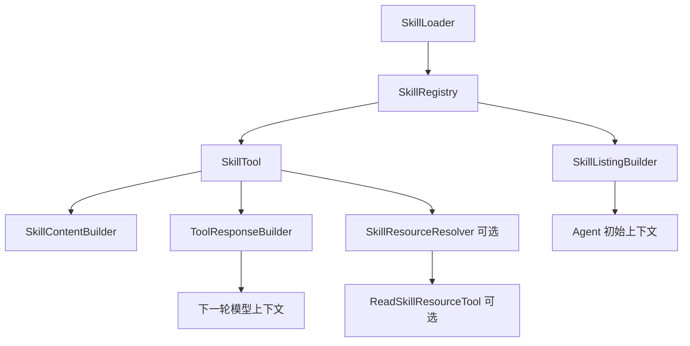
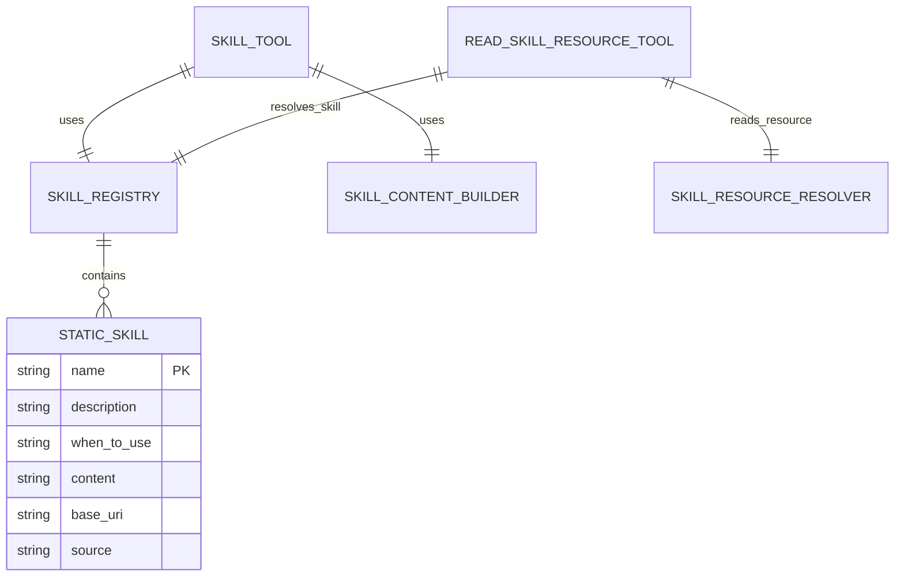
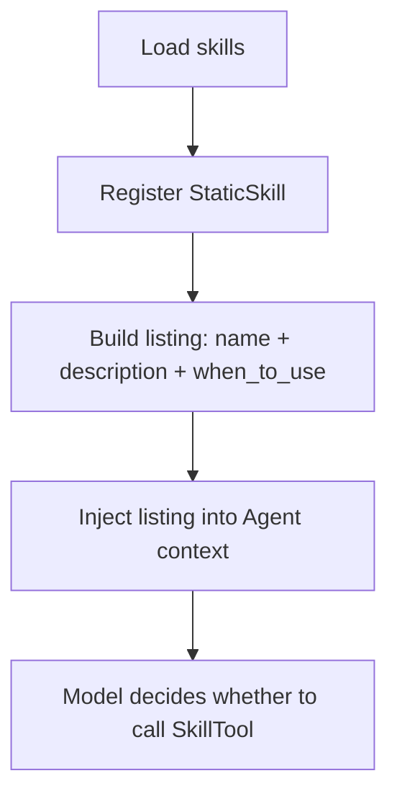
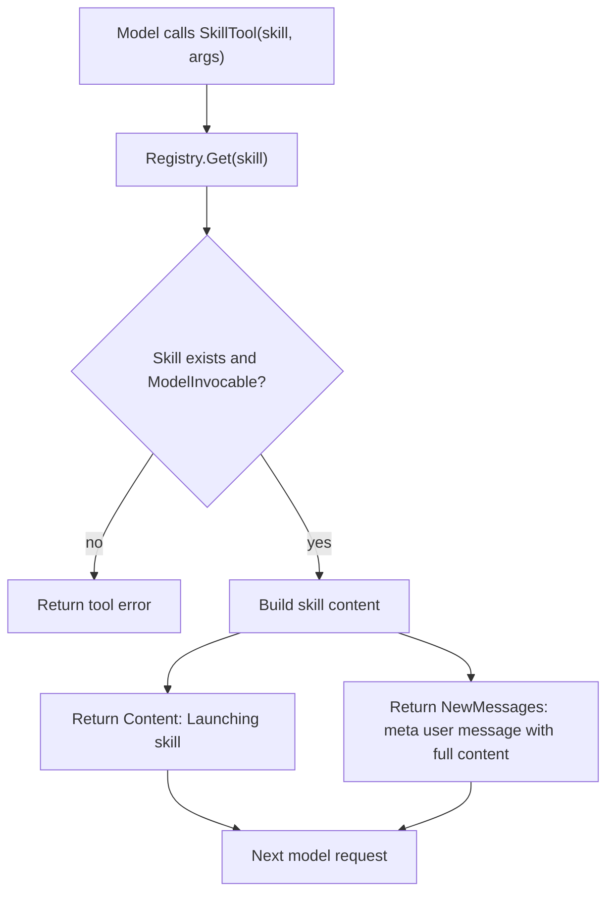
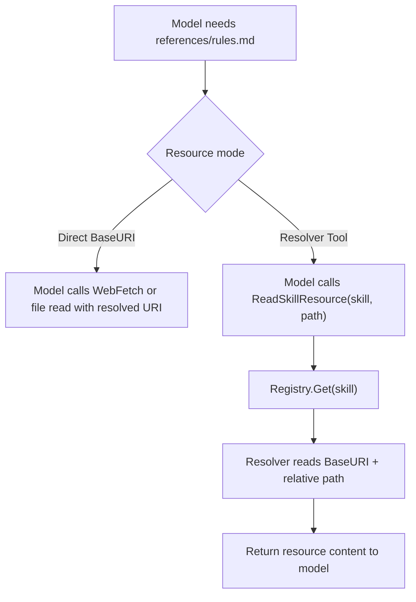

# Skill SDK Core Design

## 1. 上下文

| 项目 | 说明 |
| --- | --- |
| 范围 | Go SDK 中 Skill 作为特殊 Tool 的核心运行时设计 |
| 读者 | 后续实现 SDK 的 AI 编程代理 / 工程师 |
| 目标 | 定义 Skill 的数据结构、Tool 注册方式、渐进式披露、Content 注入、BaseDir/BaseURI 资源定位和核心 Run 流程 |
| 非目标 | 暂不设计完整权限 UI、远程鉴权、缓存淘汰、插件市场、动态下载和复杂 fork agent |
| 假设 | SDK 已有 Agent、Tool、ToolCall、ToolResponse、Message 等基础抽象 |

本设计采用与当前项目类似的渐进式披露策略：

1. 初始只向模型披露 Skill 摘要：`name`、`description`、`when_to_use`。
2. 模型判断需要使用某个 Skill 时，调用 SkillTool。
3. SkillTool 命中后读取并展开完整 `Content`。
4. 运行时把完整 Skill 内容作为 meta user message 注入下一轮模型上下文。
5. 附加资源不默认全部加载；模型需要时再调用资源读取工具，或直接使用可访问的 `BaseDir/BaseURI`。

## 2. 组件

### 2.1 组件总览



### 2.2 组件职责

| 组件 | 职责 | 依赖 | 不负责 |
| --- | --- | --- | --- |
| `SkillLoader` | 从文件、内存、OSS、HTTP 等来源加载 Skill 定义 | 外部存储 / 配置 | 不决定模型何时调用 Skill |
| `SkillRegistry` | 按名称注册、查找、去重 Skill | `StaticSkill` | 不读取资源内容 |
| `SkillListingBuilder` | 生成首次给模型看的 Skill 摘要列表 | `SkillRegistry` | 不注入完整 `Content` |
| `SkillTool` | 作为 Tool 暴露给模型，按名称执行 Skill | `SkillRegistry`、`SkillContentBuilder` | 不自动读取全部 references/assets/scripts |
| `SkillContentBuilder` | 将 `Content` 包装成模型可读内容，添加 BaseDir/BaseURI header 和内置资源说明 | `StaticSkill` | 不负责模型选择 Skill |
| `SkillResourceResolver` | 根据 `SkillName + relative path` 读取真实资源 | `BaseURI`、外部存储 | 不把真实存储细节暴露给模型 |
| `ReadSkillResourceTool` | 给模型提供统一资源读取工具 | `SkillRegistry`、`SkillResourceResolver` | 不执行 Skill 本身 |

## 3. 实体

### 3.1 实体：StaticSkill

`StaticSkill` 是 SDK 中 Skill 的静态定义。它描述一个 Skill 如何被模型发现、如何被执行、资源根在哪里。

```go
type StaticSkill struct {
	Name           string
	Description    string
	WhenToUse      string
	Content        string
	BaseURI        string
	Source         SkillSource
	ModelInvocable bool
	UserInvocable  bool
	AllowedTools   []string
	Model          string
	Metadata       map[string]any
}
```

| 字段 | 类型 | 含义 | 约束 |
| --- | --- | --- | --- |
| `Name` | string | Skill 的唯一调用名 | 必填；用于模型调用 SkillTool |
| `Description` | string | Skill 摘要说明 | 必填；首次披露给模型 |
| `WhenToUse` | string | 何时使用该 Skill 的触发说明 | 可选；建议填写 |
| `Content` | string | 完整 Skill 指令正文 | 必填；SkillTool 命中后注入模型 |
| `BaseURI` | string | Skill 附加资源根 | 可选；支持 `file://`、`https://`、`oss://`、`skill://` 等 |
| `Source` | enum | Skill 来源 | 建议保留；用于日志、权限、优先级 |
| `ModelInvocable` | bool | 是否允许模型调用 | 默认 true |
| `UserInvocable` | bool | 是否允许用户显式调用 | 默认 true |
| `AllowedTools` | []string | Skill 执行后允许的额外工具 | 可选 |
| `Model` | string | Skill 指定模型覆盖 | 可选 |
| `Metadata` | map | SDK 内部扩展信息 | 默认不传给模型 |

### 3.2 实体：SkillSource

```go
type SkillSource string

const (
	SkillSourceBuiltin SkillSource = "builtin"
	SkillSourceUser    SkillSource = "user"
	SkillSourceProject SkillSource = "project"
	SkillSourcePlugin  SkillSource = "plugin"
	SkillSourceRemote  SkillSource = "remote"
	SkillSourceMCP     SkillSource = "mcp"
)
```

| 枚举 | 含义 |
| --- | --- |
| `builtin` | SDK 内置 Skill |
| `user` | 用户配置 Skill |
| `project` | 项目配置 Skill |
| `plugin` | 插件提供 Skill |
| `remote` | OSS/HTTP/S3 等远程来源 |
| `mcp` | MCP 服务提供 Skill |

`Source` 不默认传给模型。它主要服务于日志、安全策略、去重和调试。

### 3.3 实体：ToolResponse

```go
type ToolResponse struct {
	Content      string
	NewMessages  []Message
	ContextPatch *ContextPatch
	Metadata     map[string]any
}
```

| 字段 | 类型 | 含义 | 约束 |
| --- | --- | --- | --- |
| `Content` | string | ToolResult 给模型看的短文本 | SkillTool 中通常是 `Launching skill: <name>` |
| `NewMessages` | []Message | 追加到下一轮模型上下文的消息 | SkillTool 在这里放完整 Skill 内容 |
| `ContextPatch` | *ContextPatch | 对运行时上下文的修改 | 可包含 allowed tools、model override |
| `Metadata` | map | SDK 内部调试信息 | 默认不传给模型 |

### 3.4 实体：ContextPatch

```go
type ContextPatch struct {
	AllowedTools []string
	Model        string
}
```

| 字段 | 类型 | 含义 | 约束 |
| --- | --- | --- | --- |
| `AllowedTools` | []string | Skill 执行后允许的工具 | 运行时负责合并和去重 |
| `Model` | string | Skill 指定模型覆盖 | 空值表示不覆盖 |

## 4. 关系



## 5. 流程

### 5.1 流程：首次披露 Skill 摘要

| 步骤 | 执行者 | 动作 | 输出 |
| --- | --- | --- | --- |
| 1 | `SkillLoader` | 加载所有 `StaticSkill` | Skill 定义列表 |
| 2 | `SkillRegistry` | 按 `Name` 注册 Skill | 可查询 registry |
| 3 | `SkillListingBuilder` | 读取 `Name`、`Description`、`WhenToUse` | Skill 摘要文本 |
| 4 | Agent Runtime | 把摘要注入模型初始上下文 | 模型可选择 Skill |



### 5.2 流程：SkillTool Run

| 步骤 | 执行者 | 动作 | 输出 |
| --- | --- | --- | --- |
| 1 | 模型 | 调用 `SkillTool`，输入 `skill` 和可选 `args` | ToolCall |
| 2 | `SkillTool` | 从 `SkillRegistry` 按名称查找 Skill | `StaticSkill` |
| 3 | `SkillTool` | 检查 `ModelInvocable` | 允许或拒绝 |
| 4 | `SkillContentBuilder` | 构造完整模型输入内容 | Skill content message |
| 5 | `ToolResponseBuilder` | 返回短 `Content` 和 `NewMessages` | ToolResponse |
| 6 | Agent Runtime | 将 `NewMessages` 注入下一轮模型上下文 | 模型获得完整 Skill 指令 |



### 5.3 流程：Skill Content 构造

`SkillContentBuilder` 负责在读取 `Content` 后追加内置 header。当前设计先采用与现有项目一致的形式：

```text
Base directory for this skill: <BaseURI>

<Content>
```

如果 SDK 提供 `ReadSkillResourceTool`，可以再追加资源读取说明：

```text
Additional resources for this skill are available through ReadSkillResource.
Use relative paths under this skill, for example: references/rules.md.
```

| 步骤 | 执行者 | 动作 | 输出 |
| --- | --- | --- | --- |
| 1 | `SkillContentBuilder` | 读取 `StaticSkill.Content` | 原始正文 |
| 2 | `SkillContentBuilder` | 如果 `BaseURI` 非空，添加 base header | 带资源根的正文 |
| 3 | `SkillContentBuilder` | 替换参数和内置变量 | 展开后的正文 |
| 4 | `SkillContentBuilder` | 可选追加资源读取工具说明 | 最终模型输入 |

```go
func BuildSkillContent(skill StaticSkill, args string, sessionID string, useResourceTool bool) string {
	content := skill.Content

	if skill.BaseURI != "" {
		content = "Base directory for this skill: " + skill.BaseURI + "\n\n" + content
	}

	content = strings.ReplaceAll(content, "$ARGUMENTS", args)
	content = strings.ReplaceAll(content, "${SKILL_DIR}", skill.BaseURI)
	content = strings.ReplaceAll(content, "${SESSION_ID}", sessionID)

	if useResourceTool {
		content += "\n\nAdditional resources for this skill are available through ReadSkillResource.\n"
		content += "Call ReadSkillResource with the skill name and a relative path under this skill.\n"
	}

	return content
}
```

### 5.4 流程：附加资源读取

本设计支持两种资源模式：

| 模式 | 模型看到什么 | 适用场景 |
| --- | --- | --- |
| Direct BaseURI | `Base directory for this skill: https://...` | 公开 HTTP 资源，模型有 WebFetch 工具 |
| Resolver Tool | `Use ReadSkillResource(skill, path)` | 私有 OSS/S3、本地文件、需要鉴权或统一限制 |

推荐默认使用 Resolver Tool，尤其是远程私有资源。



## 6. 契约

### 6.1 契约：BaseTool

```go
type BaseTool interface {
	Info() ToolInfo
	Run(ctx context.Context, params ToolCall) (ToolResponse, error)
}
```

| 项目 | 说明 |
| --- | --- |
| 输入 | `ToolCall`，包含工具名、参数、当前上下文引用 |
| 默认行为 | 执行工具并返回 `ToolResponse` |
| 输出 | `Content`、`NewMessages`、`ContextPatch` |
| 错误 | 工具不存在、参数非法、运行失败 |
| 副作用 | 可通过 `ContextPatch` 修改后续模型请求上下文 |

### 6.2 契约：SkillTool

```go
type SkillTool struct {
	Registry       SkillRegistry
	ContentBuilder SkillContentBuilder
}
```

| 项目 | 说明 |
| --- | --- |
| 输入 | `{ "skill": string, "args": string? }` |
| 默认行为 | 查找 Skill，构造完整 content，返回 `Launching skill` 和 `NewMessages` |
| 输出 | `ToolResponse` |
| 错误 | 未知 Skill、Skill 不允许模型调用、Content 构造失败 |
| 副作用 | 可返回 `ContextPatch`，允许额外工具或模型覆盖 |

### 6.3 契约：SkillRegistry

```go
type SkillRegistry interface {
	Register(skill StaticSkill) error
	Get(name string) (StaticSkill, bool)
	List() []StaticSkill
}
```

| 项目 | 说明 |
| --- | --- |
| 输入 | `StaticSkill` 或 Skill name |
| 默认行为 | 按 `Name` 注册和查询 |
| 输出 | Skill 定义或 Skill 列表 |
| 错误 | 重名冲突、非法名称、空内容 |
| 副作用 | 修改 registry 内部状态 |

### 6.4 契约：ReadSkillResourceTool

```go
type ReadSkillResourceInput struct {
	Skill string `json:"skill"`
	Path  string `json:"path"`
}
```

| 项目 | 说明 |
| --- | --- |
| 输入 | Skill name 和相对路径 |
| 默认行为 | 从 registry 找到 Skill，再用 resolver 读取 `BaseURI + Path` |
| 输出 | 文件内容 |
| 错误 | Skill 不存在、路径非法、资源不存在、读取失败 |
| 副作用 | 可记录资源读取日志或缓存 |

## 7. 决策

| 决策 | 采用方案 | 放弃方案 | 原因 | 影响 |
| --- | --- | --- | --- | --- |
| Skill 作为特殊 Tool | `SkillTool` 实现 `BaseTool` | 把 Skill 写死在 Agent 主流程 | 统一工具调用模型，便于扩展 | Skill 的完整内容通过 ToolResponse.NewMessages 注入 |
| 渐进式披露 | 初始只给 `name/description/when_to_use` | 初始注入所有 `Content` | 节省 token，减少上下文污染 | 模型必须先调用 SkillTool 才拿到完整指令 |
| Content 注入方式 | `NewMessages` 中追加 meta user message | 仅靠 ToolResult.Content 返回完整正文 | ToolResult 应短小，正文应进入下一轮上下文 | SDK 的 `ToolResponse` 必须支持 `NewMessages` |
| 资源根字段 | 使用 `BaseURI` | 只使用 `RootDir` | 支持 file、https、oss、s3、mcp 等来源 | 本地和远程资源可统一建模 |
| Metadata 默认不可见 | `Metadata` 仅 SDK 内部使用 | 原样传给模型 | 避免泄漏和 token 浪费 | 模型可见字段必须显式建模 |
| 远程资源读取 | 推荐 `ReadSkillResource` + Resolver | 直接暴露私有 OSS/S3 地址 | 保护鉴权信息，统一校验和缓存 | 需要额外实现资源读取工具 |

## 8. 不变量

| 不变量 | 说明 |
| --- | --- |
| Skill 初始披露不得包含完整 `Content` | 只展示摘要，保持渐进式披露 |
| `Metadata` 默认不得进入模型上下文 | 除非显式格式化为模型可见字段 |
| SkillTool 命中后必须把完整 `Content` 注入 `NewMessages` | 否则模型无法获得 Skill 指令 |
| `BaseURI` 是资源根，不保证模型可直接访问 | 是否直接访问由资源模式决定 |
| 私有远程资源不得要求模型直接拼接真实 URL | 应通过 resolver 工具读取 |
| `ReadSkillResource` 只能读取 Skill 根下相对路径 | 必须防止 path traversal |
| `AllowedTools` 和 `Model` 应通过 `ContextPatch` 应用 | 不应混入 Skill 正文让模型自行解释 |

## 9. 扩展点

| 扩展点 | 当前状态 | 后续讨论方向 |
| --- | --- | --- |
| 远程 Skill 加载 | 仅定义 `BaseURI` 和 `Source` | OSS/S3/HTTP loader、缓存、签名和刷新 |
| 权限模型 | 仅保留 `AllowedTools` | allow/deny/ask、用户确认、组织策略 |
| fork skill | 暂不展开 | 子 Agent 执行、隔离上下文、结果回传 |
| 动态 Skill | 暂不展开 | 文件触发、远程发现、条件激活 |
| 资源索引 | 暂不设计 | 是否提供 manifest 列出 references/assets/scripts |
| 多模型策略 | 仅保留 `Model` 字段 | model override、fallback、成本控制 |

